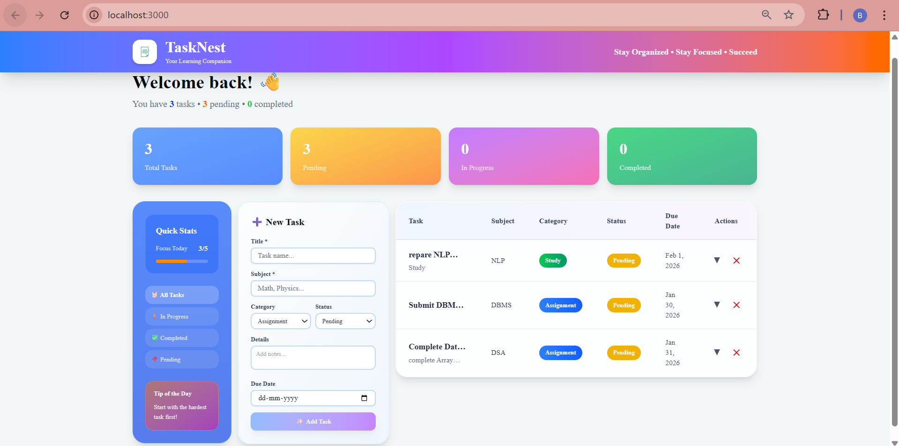
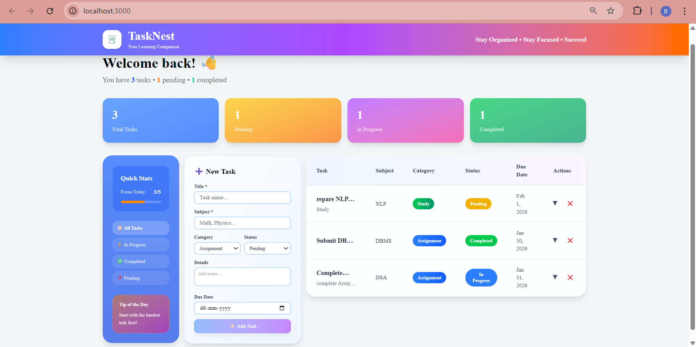
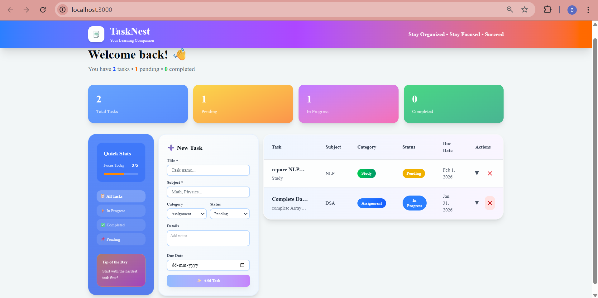

# Student Task Manager -TaskNest

Student Task Manager is a simple Single Page Application (SPA) developed using Full Stack Web Development concepts.
The main purpose of this application is to help students add, view, and manage homework or daily tasks in an efficient way without refreshing the page.

## Functional Features

## Add New Task

The application provides an input text box where students can type a task (e.g., “Complete Java Assignment”).

An “Add Task” button is available.

When the button is clicked:

The task is sent to the backend API.

The task is saved in storage (JSON file or SQLite DB).

The task immediately appears in the task list without page refresh.

 Validation Feature

Empty tasks are not allowed.

A warning message is shown if the input field is blank.

2️⃣ View / List Tasks

All added tasks are displayed in a task list section below the input box.

Tasks are fetched from the backend using the List Tasks API.

When the page loads, existing tasks are automatically displayed.

3️⃣ Single Page Application (SPA) Behavior

The website does not reload when tasks are added or listed.

JavaScript (Fetch API / AJAX) is used to:

Send requests to the backend

Update the UI dynamically

This improves user experience and performance.
## Technology Stack – Student Task Manager (Next.js)

Frontend
Next.js

Next.js is a React-based full-stack framework used to build the user interface.

It allows creation of Single Page Applications (SPA) with fast rendering and smooth navigation.

The frontend uses:

React components for UI

State management to update tasks dynamically without page reload

Client-side rendering for instant user interactions

HTML & JSX

JSX is used to design UI components.

Enables combining HTML structure with JavaScript logic.

CSS / Tailwind CSS

Used for styling the application.

Provides a clean and responsive layout.

Ensures better user experience on different screen sizes.

🧠 Backend
Next.js API Routes

Backend logic is handled using Next.js API Routes.

API routes act as server-side endpoints inside the same project.

Provides:

POST endpoint to add a task

GET endpoint to list all tasks

Eliminates the need for a separate backend server.

🔄 Client–Server Communication

Fetch API is used to send HTTP requests from frontend to backend.

Ensures asynchronous data exchange and SPA behavior.

Tasks are fetched and displayed without refreshing the page.

🗄️ Database / Storage
JSON File Storage

Tasks are stored in a local .json file.

Simple to implement using Node.js file system.

Best for beginner-level and academic projects.


🛠️ Runtime & Tools
Node.js

Required to run the Next.js application.

Handles server-side execution and API logic.

npm

Used for managing project dependencies.
## Run Locally

Clone the project

```bash
  git clone https://github.com/Bhakti-Panchal-13/Task-Nest.git
```

Go to the project directory

```bash
  cd my-project
```

Install dependencies

```bash
  npm install
```

Start the server

```bash
  npm run start
```


## Running Tests

To run tests, run the following command

```bash
  npm run test
```


## Dashboard


## Adding Task

## Updated task Status

## Deleting Task



# 🚀 Further Enhancements (Beyond Delete & Status)
1️⃣ Task Priority Levels

Allow students to assign priority (High / Medium / Low) to each task.

Helps students focus on urgent tasks first.

Improves time management and productivity.

2️⃣  Deadline Reminder

Add a due date field while creating a task.

Tasks nearing deadlines can be highlighted.

Can be extended to show reminder notifications.

3️⃣ Edit / Update Task

Students can modify task details instead of creating a new task.

Useful when assignment instructions change.

4️⃣ Task Search & Filter

Add a search bar to quickly find tasks.

Filter tasks based on:

Subject

Due date

Priority

Very helpful when the task list grows large.

5️⃣ Subject / Category Wise Tasks

Allow grouping tasks by subjects like:

DSA

Web Development

Mathematics

Makes the app more organized for students.

6️⃣ Persistent Storage & Backup

Move from local JSON to:

SQLite (better structure)

Cloud database (future scope)

Prevents data loss and improves reliability.

7️⃣ Responsive & Accessibility Improvements

Make the UI fully responsive for mobile and tablet users.

Improve accessibility with:

Keyboard navigation

Better contrast & labels

8️⃣ User Authentication (Advanced Scope)

Allow students to log in using email or student ID.

Each user gets their own task list.

Makes the app multi-user and scalable.

9️⃣ Analytics & Progress Tracking

Show simple stats like:

Total tasks added

Tasks completed per week

Motivates students to stay productive.


